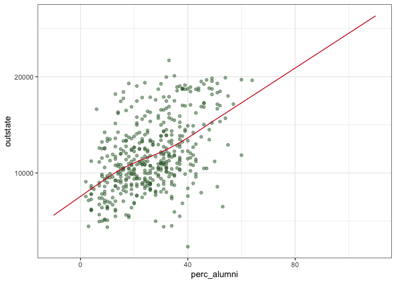
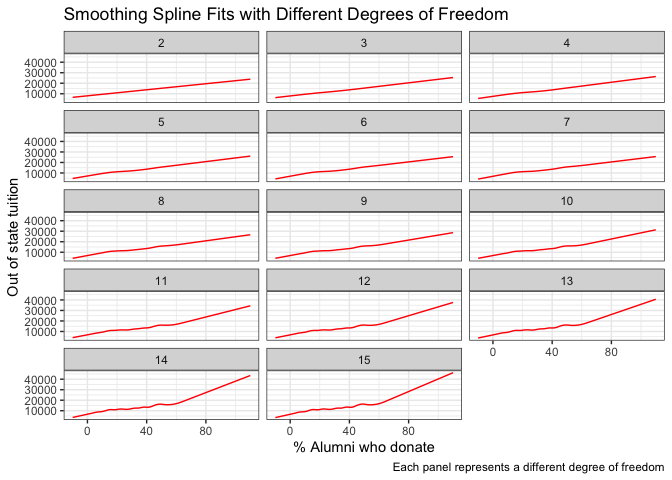
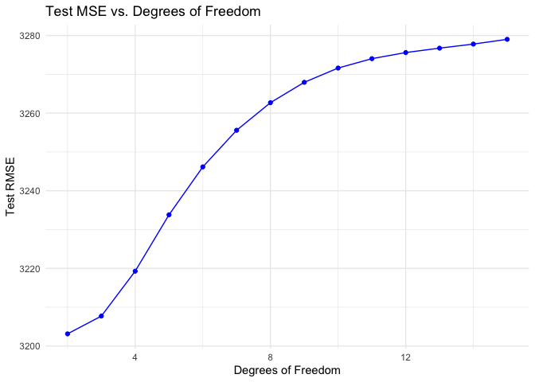
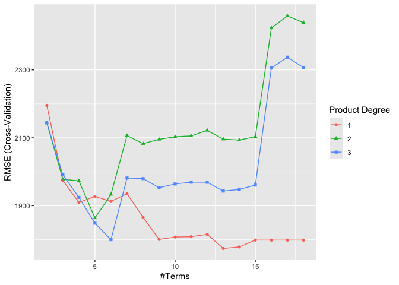
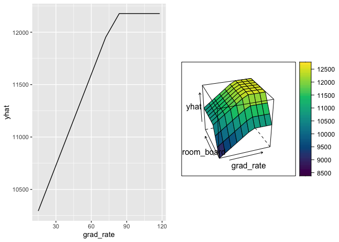
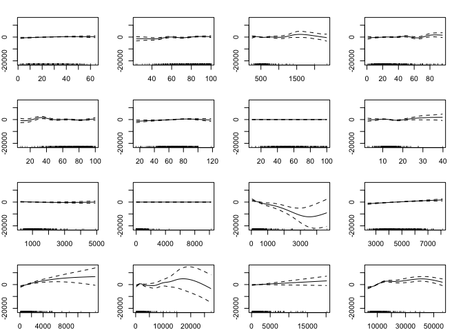
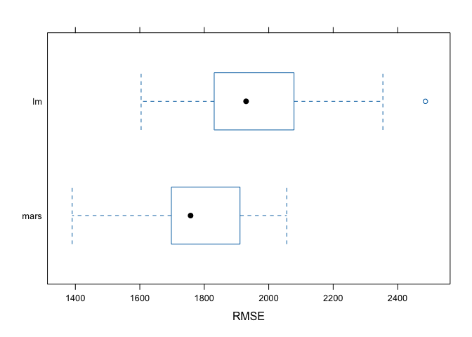

P8106 HW 2
================
Maya Krishnamoorthy
2025-03-09

Read in data and set up train/test split.

``` r
college = 
  read_csv("College.csv") %>% 
  janitor::clean_names()
```

    ## Rows: 565 Columns: 18
    ## ── Column specification ────────────────────────────────────────────────────────
    ## Delimiter: ","
    ## chr  (1): College
    ## dbl (17): Apps, Accept, Enroll, Top10perc, Top25perc, F.Undergrad, P.Undergr...
    ## 
    ## ℹ Use `spec()` to retrieve the full column specification for this data.
    ## ℹ Specify the column types or set `show_col_types = FALSE` to quiet this message.

``` r
set.seed(2025)

data_split = initial_split(college, prop = 0.8)

training_data = training(data_split) %>% select(-college)
testing_data = testing(data_split) %>% select(-college)
```

## Part a)

**Fit smoothing spline models to predict out-of-state tuition (Outstate)
using the percentage of alumni who donate (perc.alumni) as the only
predictor, across a range of degrees of freedom. Plot the fitted curve
for each degree of freedom. Describe the patterns you observe as the
degrees of freedom change. Choose an appropriate degree of freedom for
the model and plot this optimal fit. Explain the criteria you used to
select the degree of freedom.**

``` r
p = 
  ggplot(data = training_data, aes(x = perc_alumni, y = outstate)) +
  geom_point(color = rgb(.2, .4, .2, .5))

perc_alumni.grid = seq(from = -10, to = 110, by = 1) # the range of perc_alumni is [0, 100]

fit.ss = smooth.spline(training_data$perc_alumni, training_data$outstate)

pred.ss = predict(fit.ss, x = perc_alumni.grid)
pred.ss.df = data.frame(pred = pred.ss$y, perc_alum = perc_alumni.grid)

p + geom_line(aes(x = perc_alum, y = pred), data = pred.ss.df,
color = rgb(.8, .1, .1, 1)) + theme_bw()
```

<!-- -->

``` r
cv_df = fit.ss$df # generalized CV method uses df = 3.88007
```

Testing different df values:

``` r
# Define df range
df_values <- 2:15

# Create an empty list to store data frames
spline_list <- list()

test_mse <- numeric(length(df_values))

# Loop through df values and store predictions
for (i in seq_along(df_values)) {
  df <- df_values[i]
  
  # Fit smoothing spline
  fit <- smooth.spline(training_data$perc_alumni, training_data$outstate, df = df)
  
  # Get predictions
  pred_train <- predict(fit, x = perc_alumni.grid)
  
  pred_test <- predict(fit, x = testing_data$perc_alumni)
  
  # Store results in a data frame
  spline_list[[df]] <- tibble(
    perc_alum = perc_alumni.grid,
    pred = pred_train$y,
    df = factor(df)  # Convert df to a factor for faceting
  )
  
  # Compute test MSE
  test_mse[i] <- sqrt(mean((testing_data$outstate - pred_test$y)^2))
}

best_df <- df_values[which.min(test_mse)]

# Combine all predictions into one data frame
spline_predictions <- bind_rows(spline_list)

# Plot with facet_wrap()
ggplot(spline_predictions, aes(x = perc_alum, y = pred)) +
  geom_line(color = "red") +
  facet_wrap(~df, ncol = 3) +  # Arrange in 3 columns
  labs(title = "Smoothing Spline Fits with Different Degrees of Freedom",
       x = "% Alumni who donate",
       y = "Out of state tuition",
       caption = "Each panel represents a different degree of freedom") +
  theme_bw()
```

<!-- -->

``` r
# Plot MSE vs. Degrees of Freedom
mse_df <- tibble(df = df_values, MSE = test_mse)

ggplot(mse_df, aes(x = df, y = MSE)) +
  geom_point(color = "blue") +
  geom_line(color = "blue") +
  labs(title = "Test MSE vs. Degrees of Freedom",
       x = "Degrees of Freedom",
       y = "Test RMSE") +
  theme_minimal()
```

<!-- -->

These plots show the spline curves for different degrees of freedom
between 3 and 15. For lower df (2-5), the splines are very smooth and
almsot completely linear, which may be a sign of not capturing the data
entirely. For higher df (\>10), the splines may be overfitting the data
even though they are less linear. The df resulting from the generalized
CV method is 3.8800698 using the generalized CV method. The best df in
the manual range is 2.

## Part b) MARS MODEL

``` r
# matrix of predictors
x <- model.matrix(outstate ~ ., training_data)[, -1]
# vector of response
y <- training_data$outstate

test_x <- model.matrix(outstate ~ ., testing_data)[, -1]
test_y <- testing_data$outstate
```

**Fitting a model:**

``` r
set.seed(2025)

ctrl1 <- trainControl(method = "cv", number = 10)

# create grid of all possible pairs that can take degree and nprune values
mars_grid <- expand.grid(degree = 1:3, # number of possible product hinge functions in 1 term
                         nprune = 2:18) # Upper bound of number of terms in model

mars.fit <- train(x, y, # training dataset
                  method = "earth",
                  tuneGrid = mars_grid,
                  trControl = ctrl1) # 10-fold CV

ggplot(mars.fit)
```

<!-- -->

``` r
mars.fit$bestTune
```

    ##    nprune degree
    ## 12     13      1

``` r
coef(mars.fit$finalModel)
```

    ##         (Intercept)     h(14980-expend)     h(80-grad_rate)  h(4328-room_board) 
    ##       17334.2899355          -0.6464064         -28.9745892          -1.0089007 
    ## h(1405-f_undergrad)   h(15-perc_alumni)        h(apps-6548)        h(6548-apps) 
    ##          -1.3839040        -146.6145853           0.3609300          -0.7307644 
    ##       h(enroll-913)       h(913-enroll)    h(1344-personal)          h(ph_d-81) 
    ##          -2.0498812           5.6849986           0.9274978          64.9997133 
    ##      h(1611-accept) 
    ##          -0.9780810

``` r
# Calculate MSE.
mars.pred = predict(mars.fit, newdata = test_x)
mse.mars = mean((mars.pred - test_y)^2)
```

The final model uses 1 product degree, meaning that there should be no
hinge function, and 13 total terms are selected. The most important
predictors are `perc_alumni`, `grad_rate`, and `ph_d`. The test error
(MSE) is 3497772.

**Partial dependency plots:**

``` r
p1 <- pdp::partial(mars.fit, pred.var = c("grad_rate"), grid.resolution = 10) |> autoplot()
p2 <- pdp::partial(mars.fit, pred.var = c("grad_rate", "room_board"), grid.resolution = 10) |>
pdp::plotPartial(levelplot = FALSE, zlab = "yhat", drape = TRUE, screen = list(z = 20, x = -60))
gridExtra::grid.arrange(p1, p2, ncol = 2)
```

<!-- --> The
partial dependency plot on the left represents the relationship between
`grad_rate` and `outstate`, whereas the one on the right represents the
2D relationship between `room_board` and `grad_rate` with `outstate`.

## Part c)

**Construct a generalized additive model (GAM) to predict the response
variable. For the nonlinear terms included in your model, generate plots
to visualize these relationships and discuss your observations. Report
the test error.**

``` r
set.seed(2025)

gam.fit = train(x, y,
                method = "gam",
                tuneGrid = data.frame(method = "GCV.Cp", select = TRUE),
                trControl = ctrl1
)

gam.fit$finalModel
```

    ## 
    ## Family: gaussian 
    ## Link function: identity 
    ## 
    ## Formula:
    ## .outcome ~ s(perc_alumni) + s(terminal) + s(books) + s(top10perc) + 
    ##     s(ph_d) + s(grad_rate) + s(top25perc) + s(s_f_ratio) + s(personal) + 
    ##     s(p_undergrad) + s(enroll) + s(room_board) + s(accept) + 
    ##     s(f_undergrad) + s(apps) + s(expend)
    ## 
    ## Estimated degrees of freedom:
    ## 1.62 6.05 5.93 7.12 6.79 3.09 0.00 
    ## 4.28 1.04 0.00 3.80 1.39 2.32 6.43 
    ## 0.65 5.03  total = 56.53 
    ## 
    ## GCV score: 2599038

``` r
summary(gam.fit)
```

    ## 
    ## Family: gaussian 
    ## Link function: identity 
    ## 
    ## Formula:
    ## .outcome ~ s(perc_alumni) + s(terminal) + s(books) + s(top10perc) + 
    ##     s(ph_d) + s(grad_rate) + s(top25perc) + s(s_f_ratio) + s(personal) + 
    ##     s(p_undergrad) + s(enroll) + s(room_board) + s(accept) + 
    ##     s(f_undergrad) + s(apps) + s(expend)
    ## 
    ## Parametric coefficients:
    ##             Estimate Std. Error t value Pr(>|t|)    
    ## (Intercept) 11773.93      70.93     166   <2e-16 ***
    ## ---
    ## Signif. codes:  0 '***' 0.001 '**' 0.01 '*' 0.05 '.' 0.1 ' ' 1
    ## 
    ## Approximate significance of smooth terms:
    ##                      edf Ref.df      F  p-value    
    ## s(perc_alumni) 1.620e+00      9  1.259 0.000589 ***
    ## s(terminal)    6.047e+00      9  2.195 0.001509 ** 
    ## s(books)       5.930e+00      9  1.451 0.029939 *  
    ## s(top10perc)   7.119e+00      9  1.627 0.032447 *  
    ## s(ph_d)        6.790e+00      9  2.414 0.001275 ** 
    ## s(grad_rate)   3.086e+00      9  2.232 5.01e-05 ***
    ## s(top25perc)   5.561e-08      9  0.000 0.481891    
    ## s(s_f_ratio)   4.280e+00      9  2.133 0.000306 ***
    ## s(personal)    1.038e+00      9  0.471 0.017189 *  
    ## s(p_undergrad) 2.502e-08      9  0.000 0.820019    
    ## s(enroll)      3.802e+00      9  3.181 9.01e-07 ***
    ## s(room_board)  1.386e+00      9  4.614  < 2e-16 ***
    ## s(accept)      2.325e+00      9  3.045  < 2e-16 ***
    ## s(f_undergrad) 6.425e+00      9  2.395 0.000120 ***
    ## s(apps)        6.504e-01      9  0.282 0.034458 *  
    ## s(expend)      5.028e+00      9 15.342  < 2e-16 ***
    ## ---
    ## Signif. codes:  0 '***' 0.001 '**' 0.01 '*' 0.05 '.' 0.1 ' ' 1
    ## 
    ## R-sq.(adj) =  0.835   Deviance explained = 85.5%
    ## GCV = 2.599e+06  Scale est. = 2.274e+06  n = 452

**Generate plots:**

``` r
par(mar = c(2,2,2,2), mfrow = c(4,4))
plot(gam.fit$finalModel)
```

<!-- --> **Predict
the test error:**

``` r
gam.pred = predict(gam.fit, newdata = test_x)
gam.mse = mean((gam.pred - test_y)^2)
```

The GAM model includes all predictors. After graphing the
predictor-outcome relationships (left-right, top-bottom), we can say
almost surely that `books`, `enroll`, `accept`, `f_undergrad`, `expend`,
along with a few others, are non-linear. The MSE of the GAM model is
3.6014358^{6}.

## Part d)

**In this dataset, would you favor a MARS model over a linear model for
predicting out-of-state tuition? If so, why? More broadly, in general
applications, do you consider a MARS model to be superior to a linear
model? Please share your reasoning.**

Fit a linear model:

``` r
set.seed(2025)

lm.fit = train(x, y, method = "lm", trControl = ctrl1)
summary(lm.fit)
```

    ## 
    ## Call:
    ## lm(formula = .outcome ~ ., data = dat)
    ## 
    ## Residuals:
    ##     Min      1Q  Median      3Q     Max 
    ## -7349.2 -1232.8   -86.1  1273.5  9491.7 
    ## 
    ## Coefficients:
    ##               Estimate Std. Error t value Pr(>|t|)    
    ## (Intercept) 1175.37366  895.95928   1.312 0.190259    
    ## apps          -0.10587    0.12249  -0.864 0.387869    
    ## accept         1.52602    0.21688   7.036 7.72e-12 ***
    ## enroll        -4.10694    0.91043  -4.511 8.31e-06 ***
    ## top10perc     28.56297   15.57550   1.834 0.067361 .  
    ## top25perc      0.43905   12.52408   0.035 0.972051    
    ## f_undergrad    0.10020    0.14104   0.710 0.477816    
    ## p_undergrad   -0.29028    0.16147  -1.798 0.072917 .  
    ## room_board     0.76028    0.10834   7.017 8.72e-12 ***
    ## books          0.24656    0.53025   0.465 0.642175    
    ## personal      -0.39736    0.15967  -2.489 0.013196 *  
    ## ph_d           0.08312   10.20864   0.008 0.993507    
    ## terminal      33.69601   11.42265   2.950 0.003350 ** 
    ## s_f_ratio    -41.79665   31.01258  -1.348 0.178446    
    ## perc_alumni   37.73505    9.32458   4.047 6.14e-05 ***
    ## expend         0.19254    0.02836   6.789 3.71e-11 ***
    ## grad_rate     22.60406    6.72951   3.359 0.000851 ***
    ## ---
    ## Signif. codes:  0 '***' 0.001 '**' 0.01 '*' 0.05 '.' 0.1 ' ' 1
    ## 
    ## Residual standard error: 1913 on 435 degrees of freedom
    ## Multiple R-squared:  0.7438, Adjusted R-squared:  0.7343 
    ## F-statistic: 78.92 on 16 and 435 DF,  p-value: < 2.2e-16

``` r
lm.pred = predict(lm.fit, newdata = test_x)
lm.mse = mean((lm.pred - test_y)^2);lm.mse
```

    ## [1] 4683110

Resampling:

``` r
resamp = resamples(list(mars = mars.fit,
                        lm = lm.fit))

summary(resamp)
```

    ## 
    ## Call:
    ## summary.resamples(object = resamp)
    ## 
    ## Models: mars, lm 
    ## Number of resamples: 10 
    ## 
    ## MAE 
    ##          Min.  1st Qu.   Median     Mean  3rd Qu.     Max. NA's
    ## mars 1053.337 1296.272 1360.794 1355.149 1437.172 1581.728    0
    ## lm   1359.549 1473.118 1545.288 1563.753 1673.748 1786.838    0
    ## 
    ## RMSE 
    ##          Min.  1st Qu.   Median     Mean  3rd Qu.     Max. NA's
    ## mars 1390.191 1698.922 1757.560 1773.856 1908.325 2056.009    0
    ## lm   1604.087 1838.141 1929.785 1970.105 2052.426 2486.181    0
    ## 
    ## Rsquared 
    ##           Min.  1st Qu.    Median      Mean   3rd Qu.      Max. NA's
    ## mars 0.7195285 0.755149 0.7723043 0.7796291 0.7957436 0.8535869    0
    ## lm   0.6201010 0.700224 0.7455801 0.7335874 0.7788230 0.8006026    0

``` r
bwplot(resamp, metric = "RMSE")
```

<!-- --> The MARS
model has a far lower RMSE than the linear model, so it would be better
for predicting out-of-state tuition. MARS models can be preferable over
linear models in the situation when the relationships between the
predictor(s) and the outcome are not linear. If there is interaction
between predictors, MARS may perform better than linear models. However,
linear models are more easily interpretable for simple data, so in that
situation, linear models may be preferable over MARS.
